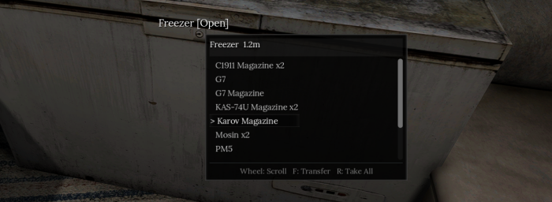

# Container Peek

<p align="center">
  
</p>

<p align="center">
  <a href="https://www.youtube.com/watch?v=SILqqw-1Vd0">
    
  </a>
</p>

`Container Peek` is a `Road to Vostok` mod that opens a compact loot window when you look at a container that the game considers interactable.

## Overview

The mod follows the game's own interaction logic instead of running a separate container scan. It uses the live interactor target, respects the container's interaction range when that information is available, and falls back to `2.5m` when it is not. The peek window hides when the game is paused so it does not overlap the pause menu.

The loot window shows item names, total displayed weight, condition, and value in a compact table with a fixed header and a real scrollbar. Rarity colors can be enabled for item names, and the selected row keeps its rarity color instead of switching to a neutral highlight color.

The mod also supports an optional rummaging system for first-time inspection. When rummaging is enabled, grouped item rows are revealed over time with a rotating icon, a single skeleton placeholder row, and optional audio. Corpse rummaging uses dedicated bundled sounds, while other containers keep the existing game-based audio behavior. By default, the mod stays enabled in shelters, but rummaging is skipped there and the full contents are shown immediately unless that behavior is changed in Mod Configuration Menu.

Take behavior is designed to stay close to the base game. You can take the selected entry or take all visible contents, and failed transfers use the same error feedback the game already uses when inventory space runs out.

## Controls

By default, the mouse wheel moves the selection in the loot list, `F` takes the selected entry to your inventory, `R` takes everything from the current container, and `V` cycles sorting between name, rarity, weight, and value. These bindings can be changed in Mod Configuration Menu when MCM is installed.

## Behavior Notes

Using the game's aim action while holding a primary or secondary weapon closes the window for the current container. The window stays hidden for that container until you look away and then look back at it, so aiming down sights is not obstructed by the preview.

When `Capture Shared Inputs` is enabled, matching game actions bound to the same key or mouse button are temporarily captured by the mod while the peek window is visible and restored when the window closes. This keeps shared bindings from also triggering game actions such as raising or lowering weapons while scrolling the peek list.

The preview groups identical item names into a single row. Because of that grouping, taking a selected row moves the first matching stack for that name rather than a specific stack instance.

When `Rummage Time / Item` is greater than `0`, newly inspected containers reveal grouped rows over time. Setting that value to `0` restores the immediate display behavior. Empty containers still spend one rummage interval in the loading state before showing `Empty`, unless rummaging has been disabled.

`Take All` is unavailable while rummaging is still in progress. When `Take All` fails because the inventory is full, it stops at the first failed insert so the result stays predictable.

The condition column is only shown for item types that the game itself treats as condition-bearing, such as weapons, armor, helmets, rigs with armor inserts, and items that explicitly enable `showCondition`. Rarity color settings only apply to the game's real rarity tiers: `Common`, `Rare`, and `Legendary`.

## Configuration

When Mod Configuration Menu is installed, the mod exposes settings for the transfer keybind, the take-all keybind, the sort keybind, shared input capture, rarity colors, rummage timing, rummage audio, whether the mod is enabled in shelters, whether rummaging is allowed in shelters, menu opacity, the optional `XP & Skills System` compatibility hook, and the three supported rarity color overrides.

`Capture Shared Inputs` controls whether the peek window temporarily blocks game actions that share the peek controls. `Rummage Time / Item` controls how long each grouped item row takes to appear during first inspection, and a value of `0` disables rummaging completely. `Rummage Audio` enables or disables the rummaging sound effect during reveal. `Show Category Icons` toggles the left-side item category icons in the preview list. `Enable In Shelter` controls whether the peek menu appears at all while you are in the shelter. `Rummage In Shelter` controls whether the same delay is applied while you are in the shelter. `Menu Opacity` changes the background opacity of the panel without affecting text readability. `XP & Skills Compat` lets popup inspection trigger that mod's search XP and scavenger bonus path without opening the native container UI. The MCM options are grouped by controls, display, rummage, shelter, compatibility, and debug settings.

Debug logging options are session-only and reset to disabled each time the game starts.

## Compatibility

- `XP & Skills System` (`ModWorkshop #55940`): supported through the optional `XP & Skills Compat` setting. When enabled, popup inspection can trigger that mod's container XP and scavenger bonus path without opening the native container UI. When rummaging is enabled, the compatibility trigger waits until rummaging finishes.
- `Mod Configuration Menu` (`ModWorkshop #53713`): optional. Required only for rebinding controls and changing settings in game.

`Container Peek` does not override `Interface.gd`, `Character.gd`, or `LootContainer.gd`. Its normal runtime model is autoload-only, with optional compatibility logic isolated under `ContainerPeek/Compat/`.

## Repository Layout

The packaged mod consists of `mod.txt` and the `ContainerPeek/` directory. The runtime logic is split across `ContainerPeek/Main.gd`, which handles scene lifecycle, state, and transfer flow; `ContainerPeek/PanelSupport.gd`, which builds and styles the peek UI; `ContainerPeek/TargetSupport.gd`, which handles target and HUD prompt helpers; `ContainerPeek/Config.gd`, which registers the MCM settings and input actions; `ContainerPeek/ConfigSupport.gd`, which provides runtime configuration helpers; `ContainerPeek/ItemSupport.gd`, which handles item summaries, rarity, weight, value, condition, and selection helpers; and `ContainerPeek/Compat/XPSkillsCompat.gd`, which contains the optional XP & Skills integration.

The repository also includes [doc/game-sync.md](doc/game-sync.md), which documents the parts of the mod that intentionally mirror decompiled game logic and should be reviewed after a game update.

## Build

Create the mod archive from the repository root with:

```bash
./scripts/build_vmz.sh
```

That produces `ContainerPeek.vmz`, which is a regular zip archive with the `.vmz` extension. The root of the archive contains `mod.txt` and the `ContainerPeek/` directory.

The build also produces `ContainerPeek.zip`, which is a regular zip file that contains the `.vmz` archive for distribution on sites that expect `.zip` uploads.

Deploy the fresh `.vmz` straight into the local game mods folder with:

```bash
./scripts/deploy.sh
```

By default this copies to `~/.steam/debian-installation/steamapps/common/Road to Vostok/mods/`. Override the destination by setting `RTV_MODS_DIR`.

## CI

GitHub Actions runs linting and build checks on pushes and pull requests:

- `./scripts/lint.sh` runs `gdlint` and `gdformat --check`
- `./scripts/build_vmz.sh` builds `ContainerPeek.vmz` and `ContainerPeek.zip`
- the workflow uploads the built `.vmz` as the CI artifact

## Installation

Copy `ContainerPeek.vmz` into the game's mod folder at `~/.steam/debian-installation/steamapps/common/Road to Vostok/mods/`, then restart the game completely.

## Requirements

The mod requires `Road to Vostok` and the community mod loader format used by the game. `Mod Configuration Menu` is optional, but it is required if you want to change bindings or adjust shared input capture, shelter behavior, rummage, audio, opacity, and rarity color settings in game.

## Licensing Note

The repository code is GPL-3.0, but the bundled MP3 files under `ContainerPeek/audio/` are explicitly excluded from that GPL grant. See [NOTICE](NOTICE) for the asset carve-out and source links.

## References

The loader format and installation details are documented at <https://github.com/ametrocavich/vostok-mod-loader>. The container script reference that helped shape the live-field handling is available at <https://modworkshop.net/mod/55135>.

## Audio Sources

The corpse rummaging audio was sourced from Pixabay:

- <https://pixabay.com/sound-effects/film-special-effects-woven-nylon-bag-rustling-and-unzipping-62127/>
